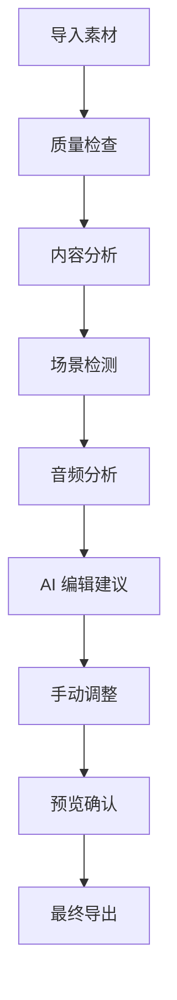

# DramaCraft 最佳实践指南

本指南提供了使用 DramaCraft 的最佳实践，帮助您高效地创建专业级视频内容。

## 🎯 项目规划

### 1. 明确项目目标

在开始任何视频项目之前，请明确以下要素：

```yaml
项目规划清单:
  ✅ 目标受众: 谁会观看这个视频？
  ✅ 核心信息: 想要传达什么？
  ✅ 视频时长: 预期的最终时长
  ✅ 风格定位: 正式、轻松、教育、娱乐？
  ✅ 技术要求: 分辨率、格式、平台要求
```

### 2. 素材准备

**视频素材要求:**
- **分辨率**: 建议使用 1080p 或更高
- **格式**: 优先使用 MP4 (H.264)
- **帧率**: 保持一致的帧率 (24/30/60 fps)
- **音频**: 48kHz, 16-bit 或更高质量

**文件组织结构:**
```
project_name/
├── raw_footage/          # 原始素材
├── audio/               # 音频文件
├── graphics/            # 图形素材
├── exports/             # 导出文件
└── project_files/       # 项目文件
```

## 🔧 技术最佳实践

### 1. 性能优化

**硬件配置建议:**
```yaml
最低配置:
  CPU: 4核心 Intel i5 或 AMD Ryzen 5
  内存: 8GB RAM
  存储: 256GB SSD
  GPU: 集成显卡

推荐配置:
  CPU: 8核心 Intel i7 或 AMD Ryzen 7
  内存: 16GB+ RAM
  存储: 512GB+ NVMe SSD
  GPU: 独立显卡 (GTX 1660 或更高)

专业配置:
  CPU: 12核心+ Intel i9 或 AMD Ryzen 9
  内存: 32GB+ RAM
  存储: 1TB+ NVMe SSD
  GPU: RTX 3070 或更高
```

**软件优化设置:**
```python
# 配置示例
config = {
    "performance": {
        "max_concurrent_jobs": 4,  # 根据CPU核心数调整
        "memory_limit": "8GB",     # 根据可用内存调整
        "temp_dir": "/fast/ssd/path",  # 使用SSD路径
        "gpu_acceleration": True,   # 如果有独立显卡
        "cache_enabled": True,      # 启用缓存
        "cache_size": "2GB"
    }
}
```

### 2. 工作流优化

**推荐的处理流程:**



**批量处理策略:**
```python
# 批量处理示例
async def process_video_batch(video_files):
    """批量处理视频文件"""
    
    # 1. 并行分析
    analysis_tasks = [
        analyze_video(video_path) 
        for video_path in video_files
    ]
    analyses = await asyncio.gather(*analysis_tasks)
    
    # 2. 生成编辑计划
    edit_plans = []
    for analysis in analyses:
        plan = await generate_edit_plan(analysis)
        edit_plans.append(plan)
    
    # 3. 执行编辑
    for plan in edit_plans:
        await execute_edit_plan(plan)
    
    return edit_plans
```

## 🎨 创意最佳实践

### 1. 视觉叙事

**场景构成原则:**
- **三分法则**: 将重要元素放在三分线交点
- **景深运用**: 利用前景、中景、背景创造层次
- **色彩搭配**: 保持色调一致性
- **运动节奏**: 静态与动态镜头的平衡

**AI 辅助创意决策:**
```python
# 获取 AI 创意建议
creative_analysis = await mcp_client.call_tool("analyze_content", {
    "video_path": "project.mp4",
    "analysis_focus": "aesthetic"
})

# 应用建议
for suggestion in creative_analysis["editing_suggestions"]:
    if suggestion["confidence"] > 0.8:
        print(f"高置信度建议: {suggestion['reason']}")
        # 考虑采用此建议
```

### 2. 音频设计

**音频层次结构:**
1. **对话/旁白** (最重要)
2. **音乐** (情感支撑)
3. **音效** (氛围增强)
4. **环境音** (真实感)

**音频处理流程:**
```python
# 音频优化流程
audio_workflow = [
    {
        "step": "noise_reduction",
        "parameters": {"strength": 0.7}
    },
    {
        "step": "normalize_volume", 
        "parameters": {"target_lufs": -23}
    },
    {
        "step": "enhance_speech",
        "parameters": {"clarity": 0.8}
    }
]

# 执行音频处理
enhanced_audio = await process_audio_workflow(
    video_path="input.mp4",
    workflow=audio_workflow
)
```

## 📊 质量控制

### 1. 技术质量检查

**自动化质量检查清单:**
```python
quality_checks = {
    "video": {
        "resolution": "≥ 1080p",
        "frame_rate": "稳定",
        "bitrate": "≥ 5 Mbps",
        "color_space": "Rec.709",
        "audio_sync": "同步"
    },
    "audio": {
        "sample_rate": "≥ 44.1kHz",
        "bit_depth": "≥ 16-bit", 
        "peak_level": "< -3dB",
        "noise_floor": "< -60dB",
        "dynamic_range": "> 12dB"
    }
}

# 执行质量检查
quality_report = await check_video_quality(
    video_path="final_output.mp4",
    standards=quality_checks
)
```

### 2. 内容质量评估

**AI 辅助质量评估:**
```python
# 获取内容质量评分
quality_assessment = await mcp_client.call_tool("analyze_content", {
    "video_path": "final_cut.mp4",
    "analysis_focus": "technical"
})

# 质量指标
metrics = quality_assessment["quality_assessment"]
print(f"整体评分: {metrics['overall_score']}/10")
print(f"技术质量: {metrics['technical_quality']}/10")
print(f"内容质量: {metrics['content_quality']}/10")

# 如果评分低于8分，考虑重新编辑
if metrics["overall_score"] < 8.0:
    print("建议进行质量优化")
```

## 🚀 高级技巧

### 1. 自定义工作流

**创建专业工作流:**
```python
# 纪录片制作工作流
documentary_workflow = {
    "name": "Documentary Production",
    "steps": [
        {
            "action": "analyze_video",
            "parameters": {
                "analysis_type": "comprehensive"
            }
        },
        {
            "action": "detect_scenes", 
            "parameters": {
                "threshold": 0.25,  # 更敏感的场景检测
                "min_scene_length": 3.0
            }
        },
        {
            "action": "analyze_audio",
            "parameters": {
                "analysis_depth": "advanced"
            }
        },
        {
            "action": "generate_edit_plan",
            "parameters": {
                "editing_objective": "professional_documentary",
                "style_preferences": {
                    "pacing": "moderate",
                    "transitions": "subtle",
                    "color_grading": "natural"
                }
            }
        }
    ]
}

# 执行工作流
result = await execute_workflow(documentary_workflow)
```

### 2. 多集项目管理

**系列项目最佳实践:**
```python
# 创建系列项目
series_project = await mcp_client.call_tool("create_project", {
    "project_name": "Documentary Series",
    "description": "5-part documentary series",
    "project_type": "series",
    "episodes": [
        {"name": "Episode 1: Introduction", "duration": 600},
        {"name": "Episode 2: Development", "duration": 720},
        {"name": "Episode 3: Challenges", "duration": 680},
        {"name": "Episode 4: Solutions", "duration": 650},
        {"name": "Episode 5: Conclusion", "duration": 580}
    ]
})

# 保持一致性
consistency_settings = {
    "color_profile": "Rec.709",
    "audio_standard": "EBU R128",
    "title_style": "series_template",
    "transition_style": "crossfade_1s"
}
```

### 3. 协作工作流

**团队协作最佳实践:**
```python
# 设置协作项目
collaboration_config = {
    "project_sharing": {
        "team_members": [
            {"role": "director", "permissions": ["read", "write", "approve"]},
            {"role": "editor", "permissions": ["read", "write"]},
            {"role": "reviewer", "permissions": ["read", "comment"]}
        ],
        "version_control": True,
        "backup_frequency": "hourly",
        "cloud_sync": True
    }
}
```

## 🔍 故障排除

### 1. 常见问题解决

**性能问题:**
```python
# 性能诊断
performance_check = {
    "memory_usage": "检查内存使用情况",
    "cpu_usage": "监控CPU负载",
    "disk_space": "确保足够的存储空间",
    "gpu_utilization": "检查GPU使用率"
}

# 优化建议
if memory_usage > 80:
    print("建议: 降低并发处理数量")
if cpu_usage > 90:
    print("建议: 使用较低的质量设置")
if disk_space < 10:
    print("警告: 磁盘空间不足")
```

**质量问题:**
```python
# 质量问题诊断
quality_issues = {
    "blurry_video": "检查源素材质量和编码设置",
    "audio_sync": "验证音频采样率和帧率匹配",
    "color_issues": "检查色彩空间和显示器校准",
    "compression_artifacts": "提高输出比特率"
}
```

### 2. 性能监控

**实时监控设置:**
```python
# 启用性能监控
monitoring_config = {
    "enable_metrics": True,
    "log_level": "INFO",
    "performance_alerts": {
        "memory_threshold": 85,
        "cpu_threshold": 90,
        "processing_time_threshold": 300
    }
}

# 监控仪表板
dashboard_metrics = [
    "processing_queue_length",
    "average_processing_time", 
    "success_rate",
    "error_rate",
    "resource_utilization"
]
```

## 📈 持续改进

### 1. 学习和优化

**数据驱动的改进:**
```python
# 收集使用数据
usage_analytics = {
    "most_used_tools": ["analyze_video", "detect_scenes"],
    "average_project_size": "2.5GB",
    "common_workflows": ["documentary", "social_media"],
    "user_feedback": "positive_95_percent"
}

# 基于数据优化工作流
optimized_workflow = optimize_based_on_usage(usage_analytics)
```

### 2. 社区参与

**参与 DramaCraft 社区:**
- 分享您的工作流和技巧
- 报告问题和建议改进
- 参与功能讨论和投票
- 贡献代码和文档

**资源链接:**
- [GitHub 仓库](https://github.com/dramacraft/dramacraft)
- [社区论坛](https://community.dramacraft.com)
- [技术博客](https://blog.dramacraft.com)
- [视频教程](https://tutorials.dramacraft.com)

---

**🎬 记住：优秀的视频制作是技术与创意的完美结合！**
